-----

# Imeck15

**Automated Image Recognition Clicker for PC Games & Apps**

Imeck15 is a powerful automation tool that recognizes specific images on your screen and automatically clicks them. It is designed to automate routine tasks with high precision and low CPU usage.

**v1.8.0.0 Update:** Now supports **OCR (Optical Character Recognition)** to read numbers and text from the screen for conditional logic\!

-----

### 🌍 Multilingual Support & Download

**Imeck15 supports 19 languages:**
English, 日本語 (Japanese), 简体中文 (Chinese), 한국어 (Korean), Español (Spanish), हिन्दी (Hindi), العربية (Arabic), Deutsch (German), Русский (Russian), Français (French), Italiano (Italian), Dansk (Danish), Nederlands (Dutch), Norsk (Norwegian), Polski (Polish), Português (Portuguese), Suomi (Finnish), Svenska (Swedish), Türkçe (Turkish).

> **📥 Download Executable (.exe)**
>
> If you do not wish to run from Python source code, please download the standalone executable for your OS from the **[Releases Page](https://github.com/ashguine-svg/Imeck15/releases)**.
>
> **The User Manual (in all supported languages) is included in the `locales` folder of the application.**

-----

## ✨ Key Features

Imeck15 goes beyond simple auto-clicking with advanced logic capabilities:

  * **📷 Image Recognition & Auto-Clicking:** Detects registered template images and clicks specific coordinates or random ranges.
  * **🔤 OCR Text Recognition (New\!):** Reads numbers or text from specified areas. You can set conditions (e.g., "Click only if HP \< 50%" or "Stop if text equals 'MAX'").
      * [cite_start]**🆕 v1.8.1 Enhanced Setup:** The OCR settings screen now features **Real-time Feedback**[cite: 2, 6, 7]. When configuring a target area, the system immediately displays the recognized text and validates the coordinates. This allows you to visually verify that your scan area is perfectly aligned before saving.
  * **📂 Smart Folder Modes:** Create complex scenarios without coding by assigning modes to folders:
      * **Sequence Priority (Cyan):** Clicks images in a strict step-by-step order. Great for login bonuses or tutorials.
      * **Cooldown (Purple):** Pauses the entire folder for a set time after any image is clicked. Perfect for "Close Ad" buttons.
      * **Image Recognition Priority (Blue):** Exclusive mode that activates only when a specific screen (e.g., "Combat Mode") is detected.
      * **Timer Priority (Green):** Interrupts routine tasks periodically (e.g., every 30 minutes).
  * **🪟 App Context & Auto-Scale:**
      * Automatically filters the image list to show only items relevant to the active window.
      * Automatically recalculates image scaling if the game window is resized.
  * **🚀 Performance Optimized:**
      * **Lightweight Mode:** Drastically reduces CPU load by lowering capture resolution.
      * **Eco Mode:** Reduces scan frequency when idle.
      * **DXCam Support:** High-speed screen capture for Windows.

-----

## 🛠️ Installation & Usage Guide (Python Source)

This guide explains how to download the source code, install dependencies, and run Imeck15 on your computer.

### Prerequisites

  * **Python:** Version 3.10 or 3.11 is recommended.
  * **Git:** Recommended for downloading and updating the project.

Please follow the instructions for your specific Operating System below.

### 💻 Windows Installation

**Step 1: Install Tesseract OCR (Required for v1.8+)**

To use the new OCR features, you must install the Tesseract OCR engine on your system.

1.  [cite_start]Download the installer (e.g., `tesseract-ocr-w64-setup-v5.x.x.exe`) from the **[UB-Mannheim GitHub](https://github.com/UB-Mannheim/tesseract/wiki)**[cite: 12].
2.  Run the installer.
3.  [cite_start]**Important:** During installation, check "Additional Script Data" -\> **"Japanese"** (and any other languages you need)[cite: 12].
4.  Adding Tesseract to your system `PATH` is recommended but usually detected automatically by the app.

**Step 2: Download Imeck15**

1.  **Install Git:** Download and install from [git-scm.com](https://git-scm.com/download/win).
2.  **Open Command Prompt:** Press `Win + R`, type `cmd`, and press Enter.
3.  **Clone the repository:**
    ```powershell
    cd %USERPROFILE%\Desktop
    git clone https://github.com/ashguine-svg/Imeck15
    ```

**Step 3: Setup Environment & Install Libraries**

1.  **Navigate to the folder:**
    ```powershell
    cd %USERPROFILE%\Desktop\Imeck15
    ```
2.  **Create a Virtual Environment:**
    ```powershell
    python -m venv venv
    ```
3.  **Activate the Virtual Environment:**
    ```powershell
    venv\Scripts\activate
    ```
4.  **Install Dependencies:**
    **You must run this command to install all required libraries from the text file:**
    ```powershell
    pip install -r requirements_windows.txt
    ```

**Step 4: Run Imeck15 🚀**

```powershell
python main.py
```

-----

### 🐧 Linux (MX Linux / Ubuntu / Debian) Installation

**⚠️ Important: System Packages**
[cite_start]You must install system tools for window management (`xdotool`, `xwininfo`) and OCR (`tesseract-ocr`, `zenity`)[cite: 13].

**Step 1: Install System Tools**

[cite_start]Run the following commands to install necessary system packages[cite: 14]:

```bash
sudo apt update
sudo apt install git python3 python3-pip python3-venv xdotool xwininfo -y
sudo apt install tesseract-ocr libtesseract-dev -y
sudo apt install zenity -y
```

**Step 2: Download Imeck15**

```bash
cd ~
git clone https://github.com/ashguine-svg/Imeck15
```

**Step 3: Setup Environment & Install Libraries**

1.  **Navigate to the folder:**
    ```bash
    cd ~/Imeck15
    ```
2.  **Create a Virtual Environment:**
    ```bash
    python3 -m venv venv
    ```
3.  **Activate the Virtual Environment:**
    ```bash
    source venv/bin/activate
    ```
4.  **Install Dependencies:**
    **You must run this command to install all required libraries from the text file:**
    ```bash
    pip install -r requirements_linux.txt
    ```

**Step 4: Run Imeck15 🚀**

```bash
python3 main.py
```

-----

## 💡 Basic Operations

  * **Start Monitoring:** Right-click (Triple Click) OR press the "Start" button.
  * **Stop Monitoring:** Right-click (Double Click) OR press the "Stop" button.

Refer to the **User Manual** (included in the app) for detailed usage instructions.

-----

## ⚙️ Architecture Diagram



```mermaid
graph TD
    subgraph UILayer [UI Layer]
        A[main.py] -- "Launch" --> B[ui.py]
        
        %% UI Composition
        B -- "Composes (Left)" --> B_Tree[ui_tree_panel.py]
        B -- "Composes (Right)" --> B_Set[ui_app_settings.py]
        
        %% UI Dependencies
        B_Tree -- "Uses" --> B1[image_tree_widget.py]
        B_Tree -- "Opens Dialogs" --> B_Item_Dlg[ui_item_dialogs.py]
        B_Tree -- "Configures" --> B_OCR_UI[ocr_settings_dialog.py]
        B_Tree -- "Configures" --> B_Timer_UI[timer_ui.py]
        B -- "Uses" --> B2[preview_mode_manager.py]
        B -- "Uses" --> B3[floating_window.py]
        B -- "Uses" --> B4[dialogs.py]
        B -- "Uses" --> B5[monitor.py]
        B -- "Uses" --> B_Custom[custom_widgets.py]
        B -- "Uses" --> B_Input_Dlg[custom_input_dialog.py]

        %% Quick Timer UI
        B -- "Opens Dialog" --> B_QT_DLG[quick_timer_dialog.py]
        B -- "Quick Timer Tab" --> B_QT_Tab[ui_quick_timer_tab.py]
        
        %% UI Helper Modules (Refactored)
        B -- "Layout Building" --> B_Layout[ui_layout_builders.py]
        B -- "Preview Update" --> B_Preview_Upd[ui_preview_update.py]
        B -- "Preview Sync" --> B_Preview_Sync[ui_preview_sync.py]
        B -- "Info Labels" --> B_Info_Labels[ui_info_labels.py]
        B -- "Wayland Guidance" --> B_Wayland[ui_wayland_guidance.py]
        
        %% Settings Model
        B_Preview_Sync -- "Normalizes" --> B_Settings_Model[settings_model.py]
        B_Item_Dlg -- "Normalizes" --> B_Settings_Model
    end

    subgraph CoreLogicLayer [Core Logic Layer]
        C[core.py] -- "Delegates Monitoring" --> C_Mon[core_monitoring.py]
        C -- "Delegates Selection" --> C_Sel[core_selection.py]
        C -- "Delegates Cache Build" --> C_Cache[cache_builder.py]
        C -- "Delegates Monitoring Control" --> C_Mon_Ctrl[monitoring_controller.py]
        C -- "Delegates Quick Timer" --> C_QT_Mgr[quick_timer_manager.py]
        C -- "Delegates Lifecycle" --> C_Lifecycle[lifecycle_manager.py]
        C -- "Input Gestures" --> C_Input_Gest[input_gestures.py]
        
        %% Monitoring States (Single File)
        C_Mon_Ctrl -- "State Machine" --> MS[monitoring_states.py]
        C_Mon -- "Uses States" --> MS
        C_Mon_Ctrl -- "Transitions" --> MS
        
        C_Cache -- "Builds Cache" --> D[template_manager.py]
        C_Cache -- "Builds Schedule" --> C_Timer_Sched[timer_schedule.py]
        C_Mon -- "Matching Task" --> E[matcher.py]
        C_Mon -- "Text Recognition" --> E_OCR[ocr_runtime.py]
        C -- "Action Request" --> F[action.py]

        %% Quick Timer Core
        C_QT_Mgr -- "QuickTimerDialogRequested" --> B
        C_Input_Gest -- "Triggers Dialog" --> C_QT_Mgr
        MS -- "Quick Timer Check" --> C_QT_Mgr
        
        %% Lifecycle Management
        C_Sel -- "Session Context" --> C_Lifecycle
        C_Lifecycle -- "Window Scale" --> C_Cache
        C_Lifecycle -- "Process Recovery" --> F
        
        E_OCR -.-> E_OCR_M[ocr_manager.py]
    end

    subgraph HardwareSystemInteraction [System Interaction]
        G[capture.py]
        F -- "Activate Window + Click/Type" --> H[Mouse/Keyboard]
        G -- "Grab Frame" --> I[Screen]
        E_OCR_M -- "OCR Engine" --> T[Tesseract Binary]
        C_Input_Gest -- "Global Mouse Listener" --> H
    end

    subgraph DataConfiguration [Data & Config]
        J[config.py]
        L[locale_manager.py]
        M[environment_tracker.py]
        K[(Images & JSON)]

        D -.-> J
        C -.-> J
        C_Cache -.-> J
        C_Lifecycle -.-> J
        B -.-> L
        B_QT_DLG -.-> L
        J <--> K
        C_Sel -.-> M
        C -.-> M
        C_Lifecycle -.-> M
    end

    %% Cross-Layer Connections
    B <--> |"Signals / Slots"| C
    C_Mon -- "Request Capture" --> G
    C_Sel -- "Request Capture" --> G
    C_QT_Mgr -- "Request Capture" --> G
```

## Module Descriptions

| Layer | File | Description |
| :--- | :--- | :--- |
| **UI Layer** | **`main.py`** | **Launcher.** Starts the application, ensures single-instance locking, and initializes the `UIManager`. |
|  | **`ui.py` (UIManager)** | **Main Controller.** Acts as the central coordinator for the UI. Manages the main window layout and delegates logic to sub-panels. |
|  | **`ui_tree_panel.py`** | **Tree Panel Logic.** Manages the image tree and opens settings dialogs (Folder/Timer/OCR). |
|  | **`ui_item_dialogs.py`** | **Item Settings Dialogs.** Encapsulates the logic for opening OCR and Timer settings dialogs with proper monitoring pause handling. |
|  | **`ui_quick_timer_tab.py`** | **Quick Timer Tab.** Manages the Quick Timer tab's UI setup, updates, and dialog opening logic. |
|  | **`ui_layout_builders.py`** | **Layout Builders.** Handles creation and placement of UI components (e.g., OCR/Timer info labels). |
|  | **`ui_preview_update.py`** | **Preview Update Logic.** Handles the update logic for the main image preview and related UI elements. |
|  | **`ui_preview_sync.py`** | **Preview Synchronization.** Handles synchronization between the UI's preview manager and core settings. |
|  | **`ui_info_labels.py`** | **Info Labels Update.** Updates OCR and Timer information labels (badge-style display) based on current settings. |
|  | **`ui_wayland_guidance.py`** | **Wayland Guidance.** Detects Wayland sessions and displays a guidance message with "Don't show again" option. |
|  | **`quick_timer_dialog.py`** | **Quick Timer UI.** Creates Quick Timer reservations by selecting ROI + click point and setting "click after N minutes" (supports left/right click and language switching). |
|  | **`ocr_settings_dialog.py`** | **OCR UI.** Provides the interface to set recognition areas (ROI), threshold, and conditions for text detection. |
|  | **`timer_ui.py`** | **Timer Settings UI.** Provides the interface to configure timer-based clicks (interval/daily/once modes). |
|  | **`ui_app_settings.py`** | **Settings Panel Logic.** Manages the "App Settings" and "Auto Scale" tabs. |
|  | **`preview_mode_manager.py`** | **Preview Manager.** Manages preview drawing and state for click/ROI settings. |
|  | **`settings_model.py`** | **Settings Data Model.** Defines structured data models (dataclasses) for application settings and provides normalization functions. |
|  | **`custom_input_dialog.py`** | **Custom Input Dialog.** Provides cross-platform string input dialog (uses `zenity` on Linux, Qt on Windows/Mac). |
|  | **`image_tree_widget.py`** | **Draggable Tree Widget.** Custom QTreeWidget with drag-and-drop support for reordering and moving items between folders. |
|  | **`floating_window.py`** | **Floating Window.** Provides a floating window for recognition area selection. |
|  | **`dialogs.py`** | **Dialog Utilities.** Provides various dialog implementations including recognition area selection dialog. |
|  | **`monitor.py`** | **Monitor Utilities.** Provides monitoring-related UI utilities. |
|  | **`custom_widgets.py`** | **Custom Widgets.** Provides custom Qt widgets including scaled pixmap label and interactive preview label. |
| **Core Logic** | **`core.py`** | **Signal Hub.** The central communication hub. Manages thread pools and connects UI signals to logic. Delegates specialized tasks to dedicated modules. |
|  | **`core_monitoring.py`** | **Monitoring Loop.** Runs the infinite monitoring thread. Handles frame capture, matching, OCR checks, Quick Timer checks, and actions. |
|  | **`monitoring_controller.py`** | **Monitoring Control.** Manages monitoring start/stop, state transitions, and state-related utilities. |
|  | **`monitoring_states.py`** | **State Machine Implementation.** Single file containing all monitoring state classes: `State` (base class), `IdleState` (default state), `TimerStandbyState` (timer-based clicks), `QuickTimerStandbyState` (Quick Timer reservations), `PriorityState` (priority folder/image matching), `SequencePriorityState` (sequential priority matching), and `CountdownState` (backup click countdown). Defines the state machine interface and handles state transitions. |
|  | **`cache_builder.py`** | **Cache Builder.** Manages template cache construction, rebuild requests, and completion callbacks. Handles thread pool coordination and UI tree state. |
|  | **`timer_schedule.py`** | **Timer Schedule Builder.** Builds timer schedule cache from template cache, handling invalid timer configurations safely. |
|  | **`quick_timer_manager.py`** | **Quick Timer Manager.** Manages Quick Timer reservations (add/remove/snapshot), triggers dialog opening, and coordinates with monitoring states. |
|  | **`input_gestures.py`** | **Input Gesture Handler.** Processes global mouse events and detects gestures (middle click for quick capture, right-click double/triple for monitoring start/stop, left+right chord hold for quick timer). |
|  | **`core_selection.py`** | **Selection Logic.** Manages the logic for recognition area and image capture selection. |
|  | **`lifecycle_manager.py`** | **Lifecycle Manager.** Handles session context attachment, window scale calculation, process/window finding, capture re-locking, and session recovery (Extended Lifecycle Hooks). |
|  | **`template_manager.py`** | **Template Manager.** Builds and manages template cache from image files and settings. Includes file existence checks to prevent crashes during folder deletion. |
|  | **`ocr_runtime.py`** | **OCR Evaluator.** Performs real-time text recognition and evaluates conditions (e.g., number comparison) during the loop. |
|  | **`ocr_manager.py`** | **OCR Utility.** Manages Tesseract configuration and language data downloads. |
|  | **`matcher.py`** | **Vision Algorithm.** Performs Template Matching (Normal/Strict Color) and calculates confidence scores. |
|  | **`action.py`** | **Executor.** Handles window activation (Windows + Linux/X11 best-effort) and sends physical mouse clicks. |
| **Hardware** | **`capture.py`** | **Screen Grabber.** Captures screen frames using `dxcam` (Windows/NVIDIA) or `mss` (Cross-platform). |
| **Data** | **`config.py`** | **File I/O.** Manages reading/writing of `app_config.json` and per-image settings files. Includes file existence checks to prevent crashes during folder deletion. |
|  | **`locale_manager.py`** | **Localization.** Loads `locales/*.json` and provides `tr()` translations with language change notifications. |
|  | **`environment_tracker.py`** | **Environment Tracking.** Tracks app/window context and screen/DPI info for logs/settings. |

## Module Relationships Summary

### UI Layer Structure
- **`main.py`** launches **`ui.py`** which coordinates all UI components
- **`ui.py`** composes **`ui_tree_panel.py`** (left) and **`ui_app_settings.py`** (right)
- UI helper modules (`ui_*`) handle specific UI responsibilities (refactored from `ui.py`)
- Settings dialogs (`ocr_settings_dialog.py`, `timer_ui.py`, `quick_timer_dialog.py`) are opened by UI components

### Core Logic Layer Structure
- **`core.py`** acts as the central hub, delegating to specialized modules:
  - **`monitoring_controller.py`**: Monitoring start/stop and state transitions
  - **`core_monitoring.py`**: Main monitoring loop execution
  - **`cache_builder.py`**: Template cache construction management
  - **`quick_timer_manager.py`**: Quick Timer reservation management
  - **`lifecycle_manager.py`**: Session and window lifecycle management
  - **`input_gestures.py`**: Global mouse gesture detection
- **Monitoring States** (implemented in single file `monitoring_states.py`):
  - Contains all state classes: `State` (base), `IdleState`, `TimerStandbyState`, `QuickTimerStandbyState`, `PriorityState`, `SequencePriorityState`, `CountdownState`
  - State transitions are managed by `monitoring_controller.py`

### Data Flow
- **Config Layer**: `config.py` manages file I/O, `locale_manager.py` handles translations, `environment_tracker.py` tracks context
- **Hardware Layer**: `capture.py` grabs frames, `action.py` performs clicks
- **Cross-layer**: Signals/Slots connect UI and Core, with thread-safe communication

