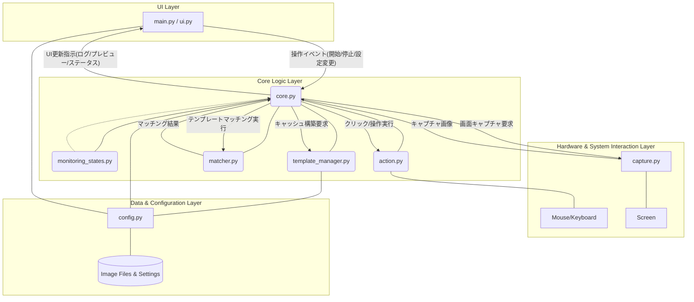

# Imeck15 - 導入と使い方ガイド

このガイドでは、Imeck15をダウンロードし、お使いのPCで実行するまでの手順を初心者の方にも分かりやすく解説します。

*Pythonではなくexe/binが必要な方は[Releases](https://github.com/ashguine-svg/Imeck15/releases)より、あなたのOS用のものをDownloadしてください。
*ページ一番下にPythonからネイティブ言語にコンパイルしものがお使いになれます。

  - **Windows**
  - **Linux (MX Linux)**
  *Pythonではなくexe/binが必要な方は[Releases](https://github.com/ashguine-svg/Imeck15/releases)より、あなたのOS用のものをDownloadしてください。
*ページ一番下にPythonからネイティブ言語にコンパイルしものがお使いになれます

お使いのOSに合わせて、それぞれの手順に従ってください。

-----

## 共通の準備：Pythonの導入

Imeck15はプログラミング言語「Python」で動作します。まずはお使いのPCにPythonをインストールしましょう。

  - **推奨バージョン:** Python 3.10 または 3.11

すでにインストール済みの方は、お使いのOSのセクションに進んでください。

-----

## 💻 Windows環境での導入手順

Windowsユーザー向けの手順です。

### ステップ1：Imeck15のダウンロード

プロジェクトファイルをPCにダウンロードします。方法は2つありますが、**Gitを使う方法が今後のアップデートに便利でおすすめです。**

>方法A：Gitを使ってダウンロードする（推奨）

1.  **Git for Windowsをインストール**
    もしPCにGitがなければ、[こちらのサイト](https://git-scm.com/download/win)からインストーラーをダウンロードしてインストールしてください。設定はすべてデフォルトのままで問題ありません。

2.  **コマンドプロンプトを開く**
    スタートメニューで「`cmd`」と検索し、「コマンドプロンプト」を起動します。

3.  **プロジェクトをダウンロード**
    以下のコマンドを実行すると、デスクトップに`Imeck15`フォルダが作成されます。

    ```powershell
    # デスクトップに移動
    cd %USERPROFILE%\Desktop

    # Imeck15をダウンロード
    git clone [https://github.com/ashguine-svg/Imeck15.git](https://github.com/ashguine-svg/Imeck15.git)
    ```

>方法B：ZIPファイルでダウンロードする

1.  GitHubプロジェクトページ右上の緑色の「**\<\> Code**」ボタンをクリックします。
2.  「**Download ZIP**」を選択します。
3.  ダウンロードしたZIPファイルを、デスクトップなどの分かりやすい場所で\*\*解凍（展開）\*\*してください。


### ステップ2：Pythonのインストール

1.  **Python公式サイトにアクセス**
    [python.org](https://www.python.org/downloads/windows/)にアクセスし、推奨バージョン（3.10や3.11）のインストーラーをダウンロードします。

2.  **インストール実行**
    インストーラーを起動し、**必ず一番下の「Add python.exe to PATH」にチェックを入れてから**、「Install Now」をクリックしてください。

    > **❗️重要:** このチェックを入れないと、コマンドプロンプトで`python`コマンドが使えず、次の手順に進めません。

### ステップ3：Imeck15の実行環境を準備する

コマンドプロンプトを使って、Imeck15を動かすための準備をします。

1.  **Imeck15フォルダに移動**
    コマンドプロンプトで、先ほどダウンロードしたImeck15のフォルダに移動します。

    ```powershell
    # デスクトップにダウンロードした場合
    cd %USERPROFILE%\Desktop\Imeck15
    ```

2.  **仮想環境の作成**
    プロジェクト専用の独立した環境を作ります。これにより、PC全体の環境を汚さずに済みます。

    ```powershell
    python -m venv venv
    ```

    フォルダ内に`venv`という新しいフォルダが作成されれば成功です。

3.  **仮想環境のアクティベート**
    作成した専用環境に入ります。

    ```powershell
    venv\Scripts\activate
    ```

    実行後、行の先頭に`(venv)`と表示されれば成功です。

4.  **必要なライブラリのインストール**
    Imeck15の動作に必要なツールをまとめてインストールします。

    ```powershell
    pip install -r requirements.txt
    ```

    > 💡 `requirements.txt`ファイルがない場合は、開発者に必要なライブラリの一覧を確認してください。（例: `pip install opencv-python Pillow PySide6`など）

### ステップ4：Imeck15の起動！ 🎉

これで準備は完了です！以下のコマンドでImeck15を起動します。

```powershell
python main.py
```

-----

## 🐧 Linux (MX Linux) 環境での導入手順

MX Linuxユーザー向けの手順です。

### ステップ1：必要なツールのインストール

まず、ターミナル（端末）を開き、Imeck15の導入に必要なツールをインストールします。

```bash
# パッケージリストを更新
sudo apt update

# 必要なツールをまとめてインストール
sudo apt install git python3 python3-pip python3-venv -y
```

### ステップ2：Imeck15のダウンロード

ターミナルで以下のコマンドを実行し、ホームディレクトリにImeck15をダウンロードします。

```bash
# ホームディレクトリに移動
cd ~

# Imeck15をダウンロード
git clone [https://github.com/ashguine-svg/Imeck15.git](https://github.com/ashguine-svg/Imeck15.git)
```

※ `ashguine-svg` の部分は、実際のプロジェクトのURLに合わせて変更してください。

### ステップ3：Imeck15の実行環境を準備する

1.  **Imeck15フォルダに移動**
    ターミナルで、ダウンロードしたImeck15フォルダに移動します。

    ```bash
    cd ~/Imeck15
    ```

2.  **仮想環境の作成**
    プロジェクト専用の独立した環境を作ります。

    ```bash
    python3 -m venv venv
    ```

3.  **仮想環境のアクティベート**
    作成した専用環境に入ります。

    ```bash
    source venv/bin/activate
    ```

    実行後、行の先頭に`(venv)`と表示されれば成功です。

4.  **必要なライブラリのインストール**
    Imeck15の動作に必要なツールをまとめてインストールします。

    ```bash
    pip install -r requirements.txt
    ```

    > 💡 `requirements.txt`ファイルがない場合は、開発者に必要なライブラリの一覧を確認してください。（例: `pip install opencv-python Pillow PySide6`など）

### ステップ4：Imeck15の起動！ 🎉

これで準備は完了です！以下のコマンドでImeck15を起動します。

```bash
python3 main.py
```

-----

## 🚀 次回からの起動方法

一度準備が完了すれば、次回からは簡単な手順で起動できます。

1.  **コマンドプロンプト（またはターミナル）を開く**
2.  **Imeck15フォルダに移動する**
      * Windows: `cd %USERPROFILE%\Desktop\Imeck15`
      * Linux: `cd ~/Imeck15`
3.  **仮想環境をアクティベートする**
      * Windows: `venv\Scripts\activate`
      * Linux: `source venv/bin/activate`
4.  **Imeck15を起動する**
      * Windows: `python main.py`
      * Linux: `python3 main.py`

## 💡 基本的な操作

  - **監視開始**: `右ダブルクリック` または `監視開始`ボタン
  - **監視停止**: `右クリック` または `監視停止`ボタン

詳しい使い方はアプリケーション内のUIをご覧ください。

## 🔧 トラブルシューティング

  - **`python`や`git`コマンドが見つからないと言われる (Windows)**

      * **原因:** インストール時に「PATHを通す」設定がされていない可能性があります。
      * **対策:** PythonやGit for Windowsを再インストールし、必ず「Add to PATH」のチェックを入れてください。

  - **`ModuleNotFoundError: No module named '...'` と表示される**

      * **原因:** 仮想環境がアクティベートされていないか、ライブラリのインストールが正常に完了していません。
      * **対策:** コマンドプロンプト（ターミナル）で行の先頭に`(venv)`と表示されているか確認してください。表示されていない場合は、アクティベートのコマンドを再実行してから`pip install -r requirements.txt`をもう一度実行してみてください。

-----

## ⚙️ モジュール構成図

このアプリケーションを構成する各ファイルが、どのような役割を持ち、どのように連携しているかを示した図です。



### 各ファイルの機能説明

| レイヤー | ファイル名 | 担当する処理 |
| :--- | :--- | :--- |
| **UI Layer** | **`main.py / ui.py`** | **アプリケーションの顔。** ユーザーが操作するウィンドウ（GUI）の表示と管理を担当します。ボタンのクリックや設定変更といったユーザーからの入力を受け付け、`core.py`に処理を依頼します。 |
| **Core Logic Layer** | **`core.py`** | **アプリケーションの頭脳・司令塔。** 全体の動作を制御します。UIからの指示を受けて監視を開始/停止し、各専門モジュール（`capture`, `matcher`など）に必要な処理を命令し、結果をUIに伝達します。 |
| | **`monitoring_states.py`** | **監視モードの専門家。** `core.py`の監視ループの複雑なロ`ジックを担当。「通常監視」「優先モード」「バックアップカウントダウン」といった各状態の振る舞いを個別のクラスとして定義し、状態遷移を管理します。 |
| | **`template_manager.py`** | **テンプレート画像の準備係。** 登録された画像ファイルを読み込み、設定（拡大率、ROIなど）に基づいて、画像認識に使用するためのデータ（キャッシュ）をメモリ上に準備します。 |
| | **`matcher.py`** | **画像認識の実行役。** `core.py`から渡された画面のキャプチャ画像と、`template_manager`が準備したテンプレート画像を比較し、一致する箇所と信頼度を計算して結果を返します。 |
| | **`action.py`** | **PC操作の実行役。** `core.py`からの指示に基づき、実際にマウスカーソルを動かしてクリックしたり、ウィンドウをアクティブにしたりといったPC操作を実行します。 |
| **Hardware & System** | **`capture.py`** | **画面のカメラマン。** PCのスクリーンや特定のウィンドウの画像を撮影（キャプチャ）する処理を担当します。`core.py`の要求に応じて、リアルタイムの画面イメージを提供します。 |
| **Data & Configuration**| **`config.py`** | **設定情報の管理人。** 登録された画像へのパス、各画像の詳細設定（クリック座標、閾値など）、アプリ全体の動作設定などをファイル（JSONなど）から読み書きする役割を担います。 |
