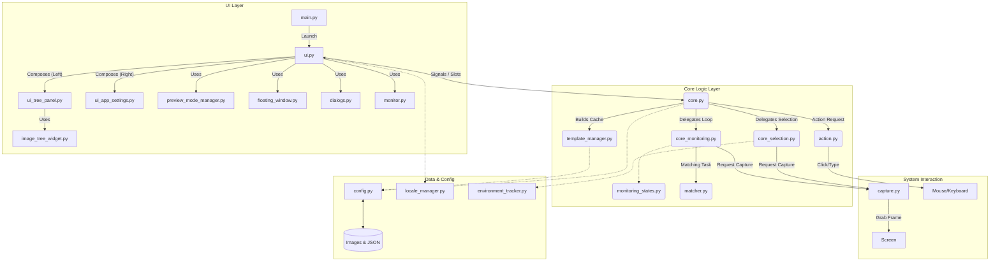

-----

# Imeck15

**Automated Image Recognition Clicker for PC Games & Apps**

Imeck15 is a powerful automation tool that recognizes specific images on your screen and automatically clicks them. It is designed to automate routine tasks with high precision and low CPU usage.

-----

### 🌍 Multilingual Support & Download

**Imeck15 supports 19 languages:**
English, 日本語 (Japanese), 简体中文 (Chinese), 한국어 (Korean), Español (Spanish), हिन्दी (Hindi), العربية (Arabic), Deutsch (German), Русский (Russian), Français (French), Italiano (Italian), Dansk (Danish), Nederlands (Dutch), Norsk (Norwegian), Polski (Polish), Português (Portuguese), Suomi (Finnish), Svenska (Swedish), Türkçe (Turkish).

> **📥 Download Executable (.exe)**
>
> If you do not wish to run from Python source code, please download the standalone executable for your OS from the **[Releases Page](https://github.com/ashguine-svg/Imeck15/releases)**.
>
> **The User Manual (in all supported languages) is included in the `locales` folder of the application.**

-----

## ✨ Key Features

Imeck15 goes beyond simple auto-clicking with advanced logic capabilities:

  * **📷 Image Recognition & Auto-Clicking:** Detects registered template images and clicks specific coordinates or random ranges.
  * **📂 Smart Folder Modes:** Create complex scenarios without coding by assigning modes to folders:
      * **Sequence Priority (Cyan):** Clicks images in a strict step-by-step order. Great for login bonuses or tutorials.
      * **Cooldown (Purple):** Pauses the entire folder for a set time after any image is clicked. Perfect for "Close Ad" buttons.
      * **Image Recognition Priority (Blue):** Exclusive mode that activates only when a specific screen (e.g., "Combat Mode") is detected.
      * **Timer Priority (Green):** Interrupts routine tasks periodically (e.g., every 30 minutes).
  * **🪟 App Context & Auto-Scale:**
      * Automatically filters the image list to show only items relevant to the active window.
      * Automatically recalculates image scaling if the game window is resized.
  * **🚀 Performance Optimized:**
      * **Lightweight Mode:** Drastically reduces CPU load by lowering capture resolution.
      * **Eco Mode:** Reduces scan frequency when idle.
      * **DXCam Support:** High-speed screen capture for Windows.

-----

## 🛠️ Installation & Usage Guide (Python Source)

This guide explains how to download the source code, install dependencies, and run Imeck15 on your computer.

### Prerequisites

  * **Python:** Version 3.10 or 3.11 is recommended.
  * **Git:** Recommended for downloading and updating the project.

Please follow the instructions for your specific Operating System below.

### 💻 Windows Installation

**Step 1: Download Imeck15**

We recommend using Git to download the project for easier updates.

1.  **Install Git:** Download and install from [git-scm.com](https://git-scm.com/download/win). Default settings are fine.
2.  **Open Command Prompt:** Press `Win + R`, type `cmd`, and press Enter.
3.  **Clone the repository:**
    ```powershell
    cd %USERPROFILE%\Desktop
    git clone https://github.com/ashguine-svg/Imeck15
    ```
    *(Alternatively, click the green **\<\> Code** button -\> **Download ZIP** and extract it.)*

**Step 2: Install Python**

1.  Go to [python.org](https://www.python.org/downloads/windows/) and download the installer for Python 3.10 or 3.11.
2.  **Important:** Check the box **"Add python.exe to PATH"** at the bottom of the installer before clicking "Install Now".

**Step 3: Setup Environment & Install Libraries**

1.  **Navigate to the folder:**
    ```powershell
    cd %USERPROFILE%\Desktop\Imeck15
    ```
2.  **Create a Virtual Environment:**
    ```powershell
    python -m venv venv
    ```
3.  **Activate the Virtual Environment:**
    ```powershell
    venv\Scripts\activate
    ```
    *(You should see `(venv)` appear at the start of your command line).*
4.  **Install Dependencies:**
    ```powershell
    pip install -r requirements_windows.txt
    ```

**Step 4: Run Imeck15 🚀**

```powershell
python main.py
```

-----

### 🐧 Linux (MX Linux / Ubuntu / Debian) Installation

**⚠️ Important: System Packages**
You **must** install `xdotool` and `xwininfo` for window detection.

**Step 1: Install System Tools**

```bash
sudo apt update
sudo apt install git python3 python3-pip python3-venv xdotool xwininfo -y
```

**Step 2: Download Imeck15**

```bash
cd ~
git clone https://github.com/ashguine-svg/Imeck15
```

**Step 3: Setup Environment & Install Libraries**

1.  **Navigate to the folder:**
    ```bash
    cd ~/Imeck15
    ```
2.  **Create a Virtual Environment:**
    ```bash
    python3 -m venv venv
    ```
3.  **Activate the Virtual Environment:**
    ```bash
    source venv/bin/activate
    ```
4.  **Install Dependencies:**
    ```bash
    pip install -r requirements_linux.txt
    ```

**Step 4: Run Imeck15 🚀**

```bash
python3 main.py
```

-----

## 💡 Basic Operations

  * **Start Monitoring:** Right-click (Triple Click) OR press the "Start" button.
  * **Stop Monitoring:** Right-click (Double Click) OR press the "Stop" button.

Refer to the **User Manual** (included in the app) for detailed usage instructions.

-----

## ⚙️ Architecture Diagram

The module structure of this application was refined through pair programming with Google's AI, **Gemini**.



### Module Descriptions

| Layer | File | Description |
| :--- | :--- | :--- |
| **UI Layer** | **`main.py`** | **Launcher.** Starts the application, ensures single-instance locking, and initializes the `UIManager`. |
| | **`ui.py` (UIManager)** | **Main Controller.** Acts as the central coordinator for the UI. Manages the main window layout and delegates logic to sub-panels (`LeftPanel`, `AppSettingsPanel`). |
| | **`ui_tree_panel.py`** | **Tree Panel Logic.** Manages the left-side panel, including the image tree, item operations (rename/delete/move), and folder structure. |
| | **`ui_app_settings.py`** | **Settings Panel Logic.** Manages the "App Settings" and "Auto Scale" tabs, handling configuration changes and UI state dependencies. |
| | **`image_tree_widget.py`** | **Custom Widget.** Implements the draggable `QTreeWidget` logic for reordering images and nesting folders. |
| | **`preview_mode_manager.py`** | **Preview Logic.** Handles image preview rendering and interactive drawing (ROI selection, click points) on the UI. |
| | `monitor.py` | **Log Viewer.** Displays the real-time application log window. |
| | `floating_window.py` | **Minimal UI.** A compact floating window for controlling the app during monitoring. |
| **Core Logic** | **`core.py`** | **Signal Hub.** The central communication hub. Manages thread pools, connects UI signals to logic, and holds the application state. |
| | **`core_monitoring.py`** | **Monitoring Loop.** Runs the infinite monitoring thread. Handles frame capture timing, ECO mode, and delegates matching to the current State. |
| | **`core_selection.py`** | **Selection Handler.** Manages the logic for selecting the recognition area (Rectangle, Window, Fullscreen) and saving reference images. |
| | **`monitoring_states.py`** | **State Machine.** Defines behavior for different modes: `Idle`, `Priority` (Image/Timer), `Sequence`, and `Countdown`. |
| | **`template_manager.py`** | **Cache Builder.** Loads images from disk and generates multi-scale template caches for OpenCV. |
| | **`matcher.py`** | **Vision Algorithm.** The mathematical core. Performs Template Matching (Normal/Strict Color) and calculates confidence scores. |
| | **`action.py`** | **Executor.** Handles window activation and sends physical mouse clicks. |
| **Hardware** | **`capture.py`** | **Screen Grabber.** Captures screen frames using `dxcam` (Windows/NVIDIA) or `mss` (Cross-platform). |
| **Data** | **`config.py`** | **File I/O.** Manages reading/writing of `app_config.json` and per-image settings files. |
| | **`environment_tracker.py`** | **Environment Info.** Tracks screen resolution, DPI, and app titles to ensure settings match the current environment. |
| | **`locale_manager.py`** | **Localization.** Loads translation JSON files and provides localized strings for the UI and Logs. |
