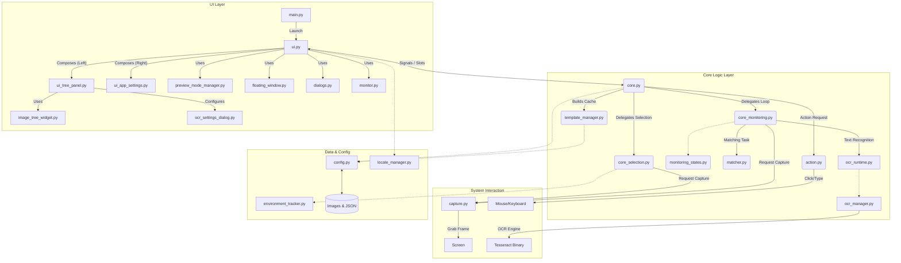

-----

# Imeck15

**Automated Image Recognition Clicker for PC Games & Apps**

Imeck15 is a powerful automation tool that recognizes specific images on your screen and automatically clicks them. It is designed to automate routine tasks with high precision and low CPU usage.

**v1.8.0.0 Update:** Now supports **OCR (Optical Character Recognition)** to read numbers and text from the screen for conditional logic\!

-----

### 🌍 Multilingual Support & Download

**Imeck15 supports 19 languages:**
English, 日本語 (Japanese), 简体中文 (Chinese), 한국어 (Korean), Español (Spanish), हिन्दी (Hindi), العربية (Arabic), Deutsch (German), Русский (Russian), Français (French), Italiano (Italian), Dansk (Danish), Nederlands (Dutch), Norsk (Norwegian), Polski (Polish), Português (Portuguese), Suomi (Finnish), Svenska (Swedish), Türkçe (Turkish).

> **📥 Download Executable (.exe)**
>
> If you do not wish to run from Python source code, please download the standalone executable for your OS from the **[Releases Page](https://github.com/ashguine-svg/Imeck15/releases)**.
>
> **The User Manual (in all supported languages) is included in the `locales` folder of the application.**

-----

## ✨ Key Features

Imeck15 goes beyond simple auto-clicking with advanced logic capabilities:

  * **📷 Image Recognition & Auto-Clicking:** Detects registered template images and clicks specific coordinates or random ranges.
  * **🔤 OCR Text Recognition (New\!):** Reads numbers or text from specified areas. You can set conditions (e.g., "Click only if HP \< 50%" or "Stop if text equals 'MAX'").
  * **📂 Smart Folder Modes:** Create complex scenarios without coding by assigning modes to folders:
      * **Sequence Priority (Cyan):** Clicks images in a strict step-by-step order. Great for login bonuses or tutorials.
      * **Cooldown (Purple):** Pauses the entire folder for a set time after any image is clicked. Perfect for "Close Ad" buttons.
      * **Image Recognition Priority (Blue):** Exclusive mode that activates only when a specific screen (e.g., "Combat Mode") is detected.
      * **Timer Priority (Green):** Interrupts routine tasks periodically (e.g., every 30 minutes).
  * **🪟 App Context & Auto-Scale:**
      * Automatically filters the image list to show only items relevant to the active window.
      * Automatically recalculates image scaling if the game window is resized.
  * **🚀 Performance Optimized:**
      * **Lightweight Mode:** Drastically reduces CPU load by lowering capture resolution.
      * **Eco Mode:** Reduces scan frequency when idle.
      * **DXCam Support:** High-speed screen capture for Windows.

-----

## 🛠️ Installation & Usage Guide (Python Source)

This guide explains how to download the source code, install dependencies, and run Imeck15 on your computer.

### Prerequisites

  * **Python:** Version 3.10 or 3.11 is recommended.
  * **Git:** Recommended for downloading and updating the project.

Please follow the instructions for your specific Operating System below.

### 💻 Windows Installation

**Step 1: Install Tesseract OCR (Required for v1.8+)**

To use the new OCR features, you must install the Tesseract OCR engine on your system.

1.  Download the installer (e.g., `tesseract-ocr-w64-setup-v5.x.x.exe`) from the **[UB-Mannheim GitHub](https://github.com/UB-Mannheim/tesseract/wiki)**.
2.  Run the installer.
3.  **Important:** During installation, check "Additional Script Data" -\> **"Japanese"** (and any other languages you need).
4.  Adding Tesseract to your system `PATH` is recommended but usually detected automatically by the app.

**Step 2: Download Imeck15**

1.  **Install Git:** Download and install from [git-scm.com](https://git-scm.com/download/win).
2.  **Open Command Prompt:** Press `Win + R`, type `cmd`, and press Enter.
3.  **Clone the repository:**
    ```powershell
    cd %USERPROFILE%\Desktop
    git clone https://github.com/ashguine-svg/Imeck15
    ```

**Step 3: Setup Environment & Install Libraries**

1.  **Navigate to the folder:**
    ```powershell
    cd %USERPROFILE%\Desktop\Imeck15
    ```
2.  **Create a Virtual Environment:**
    ```powershell
    python -m venv venv
    ```
3.  **Activate the Virtual Environment:**
    ```powershell
    venv\Scripts\activate
    ```
4.  **Install Dependencies:**
    **You must run this command to install all required libraries from the text file:**
    ```powershell
    pip install -r requirements_windows.txt
    ```

**Step 4: Run Imeck15 🚀**

```powershell
python main.py
```

-----

### 🐧 Linux (MX Linux / Ubuntu / Debian) Installation

**⚠️ Important: System Packages**
You must install system tools for window management (`xdotool`, `xwininfo`) and OCR (`tesseract-ocr`, `zenity`).

**Step 1: Install System Tools**

Run the following commands to install necessary system packages:

```bash
sudo apt update
sudo apt install git python3 python3-pip python3-venv xdotool xwininfo -y
sudo apt install tesseract-ocr libtesseract-dev -y
sudo apt install zenity -y
```

**Step 2: Download Imeck15**

```bash
cd ~
git clone https://github.com/ashguine-svg/Imeck15
```

**Step 3: Setup Environment & Install Libraries**

1.  **Navigate to the folder:**
    ```bash
    cd ~/Imeck15
    ```
2.  **Create a Virtual Environment:**
    ```bash
    python3 -m venv venv
    ```
3.  **Activate the Virtual Environment:**
    ```bash
    source venv/bin/activate
    ```
4.  **Install Dependencies:**
    **You must run this command to install all required libraries from the text file:**
    ```bash
    pip install -r requirements_linux.txt
    ```

**Step 4: Run Imeck15 🚀**

```bash
python3 main.py
```

-----

## 💡 Basic Operations

  * **Start Monitoring:** Right-click (Triple Click) OR press the "Start" button.
  * **Stop Monitoring:** Right-click (Double Click) OR press the "Stop" button.

Refer to the **User Manual** (included in the app) for detailed usage instructions.

-----

## ⚙️ Architecture Diagram

The module structure of this application was refined through pair programming with Google's AI, **Gemini**.



### Module Descriptions

| Layer | File | Description |
| :--- | :--- | :--- |
| **UI Layer** | **`main.py`** | **Launcher.** Starts the application, ensures single-instance locking, and initializes the `UIManager`. |
| | **`ui.py` (UIManager)** | **Main Controller.** Acts as the central coordinator for the UI. Manages the main window layout and delegates logic to sub-panels. |
| | **`ui_tree_panel.py`** | **Tree Panel Logic.** Manages the image tree and opens settings dialogs (Folder/Timer/OCR). |
| | **`ocr_settings_dialog.py`** | **OCR UI.** **(New)** Provides the interface to set recognition areas (ROI), threshold, and conditions for text detection. |
| | **`ui_app_settings.py`** | **Settings Panel Logic.** Manages the "App Settings" and "Auto Scale" tabs. |
| **Core Logic** | **`core.py`** | **Signal Hub.** The central communication hub. Manages thread pools and connects UI signals to logic. |
| | **`core_monitoring.py`** | **Monitoring Loop.** Runs the infinite monitoring thread. Handles frame capture, matching, **OCR checks**, and actions. |
| | **`ocr_runtime.py`** | **OCR Evaluator.** **(New)** Performs real-time text recognition and evaluates conditions (e.g., number comparison) during the loop. |
| | **`ocr_manager.py`** | **OCR Utility.** **(New)** Manages Tesseract configuration and language data downloads. |
| | **`matcher.py`** | **Vision Algorithm.** Performs Template Matching (Normal/Strict Color) and calculates confidence scores. |
| | **`action.py`** | **Executor.** Handles window activation and sends physical mouse clicks. |
| **Hardware** | **`capture.py`** | **Screen Grabber.** Captures screen frames using `dxcam` (Windows/NVIDIA) or `mss` (Cross-platform). |
| **Data** | **`config.py`** | **File I/O.** Manages reading/writing of `app_config.json` and per-image settings files. |
